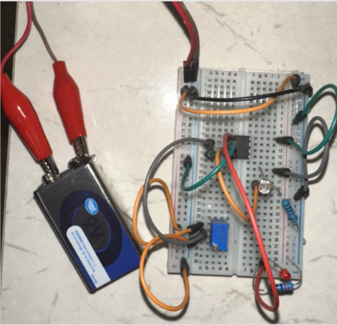

# Automatic Street Light / Dark Detector Circuit

## Overview

This project is an automatic street light / dark detector circuit designed for ECE3570. The circuit uses an LDR (Light Dependent Resistor) and an LM741 op-amp to detect changes in surrounding light intensity. When the environment becomes dark, the LED turns on automatically. When there is enough light, the LED turns off.

The main goal of this project was to demonstrate how basic electronic components can be combined to create an automatic control system that responds to real-world environmental changes.

## Project Files

* [Project Presentation PDF](docs/automatic-street-light-dark-detector-presentation.pdf)
* [Project Demonstration Video](https://www.youtube.com/shorts/w5eZVy3OntA)
* [Breadboard Circuit Photo](images/breadboard-circuit-photo_new.png)
* [Circuit Diagram](images/circuit-diagram.png)

## Project Preview

### Breadboard Circuit

### Circuit Diagram

## Project Purpose

The purpose of this project was to design and build a circuit that automatically responds to changing light conditions. Instead of manually turning a light on and off, the circuit senses the surrounding brightness and controls the LED output based on the detected light level.

This project demonstrates:

* Light sensing using an LDR
* Voltage divider circuit behavior
* Comparator operation using an op-amp
* Reference voltage adjustment using a potentiometer
* Automatic LED control based on light intensity
* Practical use of analog electronics in a real-world system

## How the Circuit Works

The LDR and a 10 kΩ resistor form a voltage divider. As the amount of light changes, the resistance of the LDR changes, which also changes the voltage going into the op-amp.

The potentiometer is used to set a reference voltage. The LM741 op-amp compares the LDR sensor voltage with this reference voltage. Based on the comparison, the op-amp output changes state and controls the LED.

When the circuit detects darkness, the LED turns on. When the circuit detects bright light, the LED turns off.

## Components Used

| Component                   | Purpose                                                |
| --------------------------- | ------------------------------------------------------ |
| LM741 Op-Amp                | Compares the sensor voltage with the reference voltage |
| LDR                         | Detects surrounding light intensity                    |
| 10 kΩ Resistor              | Forms a voltage divider with the LDR                   |
| Potentiometer               | Adjusts the reference voltage and sensitivity          |
| 220 Ω Resistor              | Limits current through the LED                         |
| LED                         | Output indicator                                       |
| 9V Battery                  | Power supply                                           |
| Breadboard and Jumper Wires | Circuit construction                                   |

## Circuit Operation

1. The LDR senses the surrounding light level.
2. The LDR resistance changes depending on brightness.
3. The LDR and 10 kΩ resistor create a changing sensor voltage.
4. The potentiometer sets a reference voltage.
5. The LM741 op-amp compares the sensor voltage and reference voltage.
6. The LED turns on or off depending on the op-amp output.
7. The potentiometer can be adjusted to change the light sensitivity of the circuit.

## Real-World Applications

This type of circuit can be used in:

* Automatic street lighting
* Garden and outdoor lights
* Security lighting systems
* Parking lot lighting
* Energy-saving smart lighting systems
* Pathway and campus lighting

## Benefits

* Simple and low-cost design
* Automatic operation
* Reduces the need for manual switching
* Saves energy by turning lights on only when needed
* Easy to build, test, and understand
* Good introduction to sensors and op-amp comparator circuits

## Drawbacks and Limitations

* The sensitivity needs to be adjusted using the potentiometer.
* Performance can change depending on surrounding light conditions.
* The LM741 is not the best op-amp for single-supply operation.
* The circuit is suitable for small loads unless extra components are added.
* To control larger lamps, a transistor, relay, or MOSFET stage would be needed.

## Possible Improvements

Future improvements could include:

* Replacing the LM741 with a better single-supply op-amp or comparator
* Adding a transistor or relay to control a larger lamp
* Adding hysteresis to prevent flickering near the switching point
* Using a regulated power supply for more stable operation
* Designing a PCB version of the circuit
* Adding an enclosure for outdoor use

## Demonstration

The project demonstration video shows the circuit responding to light and darkness in real time.

[Watch the Project Demonstration Video](https://www.youtube.com/shorts/w5eZVy3OntA)

The demonstration includes:

* The LED turning on in dark conditions
* The LED turning off in bright conditions
* The effect of adjusting the potentiometer
* The working breadboard model in real time

## Skills Demonstrated

* Analog circuit design
* Sensor-based circuit design
* Op-amp comparator operation
* Breadboard prototyping
* Voltage divider analysis
* Circuit troubleshooting
* Component selection
* Technical presentation
* Real-world electronics application

## Author

Abid Ahmad
Electrical and Computer Engineering
Wayne State University
